# Browser egress proxy implementation contract

Status: **implementation and deployment scaffold complete in source; deployed runtime evidence is still required and production release remains blocked**

This document turns the security decision in
`docs/business-evals/BROWSERBASE_EGRESS_SECURITY_SPEC.md` into an implementation
contract for the implemented `infra/browser-egress-proxy/` service. The source
now includes the Go policy dialer, pinned and patched interception layer,
two-role deployment definitions, in-guest firewall bootstrap, runtime guard,
internal PKI tooling, and test suites. It does not
authorize a provider purchase, create a Fly app, upload a certificate, change a
Browserbase session, or enable a runner. The existing application-side request
guard remains required and intentionally independent.

## Decision

We will not implement the production gateway as a Node.js service, a Next.js
route, a Vercel function, an unfiltered Envoy dynamic forward proxy, or a normal
CONNECT tunnel. Those designs do not credibly provide the combined TLS
interception, HTTP/1.1 and HTTP/2 protocol enforcement, all-answer DNS policy,
connection-time IP pinning, bounded streaming, and disconnected-session
authority required by the security specification.

The selected implementation is an isolated two-role gateway:

1. A pinned **mitmproxy interception service** authenticates Browserbase,
   intercepts target TLS with the dedicated Maintain Flow proxy CA, parses
   HTTP/1.1 and HTTP/2, rejects unsupported protocols, enforces message limits,
   and forwards every permitted upstream connection to one internal proxy.
2. A small **Go CONNECT-only policy dialer** normalizes the authority, performs
   fresh all-answer A and AAAA resolution, rejects the whole destination if any
   answer is unsafe, chooses one permitted address, and connects to that exact
   address without a second DNS lookup or address retry.

The roles run in separate Fly apps with separate secret stores and defense-in-
depth network policies. Fly documents that Network Policies apply only to
traffic directly to and from Machines and **do not affect traffic routed through
Fly Proxy**. Fly policy is therefore not the authoritative interception egress
boundary. Before mitmproxy starts, a privileged in-guest initializer must apply
a default-deny nftables or iptables ruleset that permits only established reply
traffic and TCP to the exact private policy-dialer addresses on port 9443. It
then launches mitmproxy as a non-root user with no `CAP_NET_ADMIN` or equivalent
authority to change that ruleset.

The interception app cannot egress directly to any arbitrary public
destination, including public port 443 and destinations reached through Fly
Proxy. The dialer has no public listener and is the only role permitted to
connect to public target port 443. This layered deployment boundary prevents a
mitmproxy configuration error or interception-layer compromise from silently
bypassing the dialer. It remains a hard no-go gate until active probes prove the
in-guest boundary on the exact deployed Machines.

This design uses a mature TLS-interception and HTTP parsing implementation but
keeps the security-specific resolver and exact-IP dial behavior small enough to
review exhaustively. It still requires independent security review before
production. A design document, green unit tests, or a deployed proxy is not
proof that the gateway is safe.

## Evidence basis

I inspected the current Browserbase provider, page scanner, browser request
guard, deployment readiness checks, and the pinned Browserbase SDK contract.
The current application creates one authenticated catch-all external
proxy rule and disables provider stealth, CAPTCHA solving, recording, logging,
and certificate-error bypass. It binds the reviewed Browserbase project and
public proxy CA certificate IDs, uses short-lived signed per-session proxy
credentials, and correctly leaves the runner disabled until the deployed
topology and provider canaries are evidenced.

The design is constrained by these observed facts:

- Browserbase `allowedDomains` protects main-frame navigation only, not frames,
  workers, subresources, or XHR.
- Playwright routing and WebSocket rejection belong to the connected
  controller and are not authoritative while a keep-alive browser is
  disconnected.
- A normal CONNECT proxy sees the target authority but cannot distinguish HTTPS
  from encrypted WSS inside the tunnel.
- Envoy's stock resolved-address filter can remove blocked answers rather than
  reject a mixed answer and can retain a previously public DNS-cache entry.
- The inspected mitmproxy HTTP/1 parser does not itself provide the required
  64 KiB pre-parse header bound. That gap must be patched and tested; an addon
  that rejects headers only after parsing is not sufficient.
- An explicit HTTP(S) proxy does not inherently capture WebRTC, STUN, TURN, or
  arbitrary UDP emitted directly by the remote browser.
- [Fly's Network Policies documentation](https://fly.io/docs/machines/guides-examples/network-policies/)
  explicitly excludes traffic routed through Fly Proxy. A Fly policy alone
  cannot prove that the interception role lacks a public egress path.

Authoritative design references:

- [Browserbase custom proxy and CA support](https://docs.browserbase.com/platform/identity/proxies)
- [Browserbase keep-alive sessions](https://docs.browserbase.com/platform/browser/long-sessions/keep-alive)
- [mitmproxy proxy modes](https://docs.mitmproxy.org/stable/concepts/modes/)
- [mitmproxy protocol support](https://docs.mitmproxy.org/stable/concepts/protocols/)
- [mitmproxy options](https://docs.mitmproxy.org/stable/concepts/options/)
- [Fly public services](https://fly.io/docs/networking/services/)
- [Fly network policies](https://fly.io/docs/machines/guides-examples/network-policies/)
- [Fly health checks](https://fly.io/docs/reference/health-checks/)
- [IANA IPv4 special-purpose registry](https://www.iana.org/assignments/iana-ipv4-special-registry/iana-ipv4-special-registry.xhtml)
- [IANA IPv6 special-purpose registry](https://www.iana.org/assignments/iana-ipv6-special-registry/iana-ipv6-special-registry.xhtml)

## Security invariants

The implementation is acceptable only if all of these are falsifiably true:

1. Browserbase has exactly one external proxy rule, it has no domain pattern,
   and no direct, `none`, managed, residential, or geolocation fallback exists.
2. The public gateway exposes only an authenticated HTTPS proxy on port 443.
   Port 80 is closed rather than redirected. No public health, admin, metrics,
   DNS, SOCKS, raw TCP, or UDP listener exists.
3. Every browser-originated connection is TLS-intercepted. There is no
   pass-through host, certificate-error bypass, or protocol tunnel.
4. A root-applied, default-deny in-guest firewall permits interception egress
   only for established replies and TCP to the exact private dialer addresses
   on port 9443. Mitmproxy runs non-root without `CAP_NET_ADMIN`, cannot alter
   that firewall, and cannot reach an arbitrary public destination or a public
   Fly Proxy route even if its upstream-proxy configuration is removed. Fly
   Network Policy is required defense in depth but is never treated as
   sufficient evidence for this invariant.
5. The dialer rejects the entire hostname when any A or AAAA result, any CNAME
   target, or any mapped/translated form is policy-blocked.
6. The address selected by policy is the address passed to the kernel dial call.
   There is no resolver call between approval and connect, no Happy Eyeballs
   fallback, and no retry against a different address.
7. The original normalized hostname remains the TLS SNI and certificate/SAN
   verification identity. The pinned IP never weakens hostname validation.
8. HTTP Upgrade, WebSocket, extended CONNECT, CONNECT-UDP, WebTransport,
   HTTP/3, QUIC, raw TCP, raw UDP, and unknown protocol transitions fail before
   any upstream connection is opened.
9. A gateway, resolver, dialer, certificate, credential, policy, or capacity
   failure produces a closed connection and an infrastructure/policy outcome.
   It can never become a green business verdict.
10. No request or response body, URL, query string, cookie, header, form value,
    target certificate, credential, CA private key, Browserbase connection URL,
    or raw hostname is persisted or emitted to logs.
11. A gateway outage cannot cause Browserbase to fall back to direct or managed
    egress.
12. The exact image digest, policy fingerprint, CA fingerprint, Browserbase
    project, Fly releases, and app commit are bound to every production canary.

## Request path and trust boundaries

```mermaid
flowchart LR
  BB["Browserbase Chromium<br/>untrusted browser activity"]
  FE["Fly TLS edge<br/>443 only"]
  MI["Interception app<br/>mitmproxy + policy addon"]
  FW["In-guest default-deny firewall<br/>established replies + exact dialer:9443"]
  NP1["Fly egress policy<br/>defense in depth"]
  DI["Private dialer app<br/>Go CONNECT policy dialer"]
  NP2["Fly egress policy<br/>443 targets + 853 DNS only"]
  DOT["Pinned DNS-over-TLS resolvers"]
  DST["Selected public IP:443"]

  BB -->|"HTTPS proxy + Basic auth"| FE
  FE -->|"HTTP/1.1 proxy stream"| MI
  MI -->|"mTLS CONNECT host:443"| FW
  FW --> NP1
  NP1 --> DI
  DI -->|"fresh A + AAAA, absolute name"| DOT
  DOT -->|"complete answer sets"| DI
  DI -->|"TCP to exact approved IP"| NP2
  NP2 --> DST
  MI -. "cannot reach public/Fly Proxy :443" .-> FW
```



The outer TLS connection protects the Browserbase proxy credential in transit.
Fly terminates only this outer proxy TLS connection. After a successful CONNECT,
Chromium begins the target TLS handshake. Mitmproxy terminates that target TLS
using a leaf certificate signed by the dedicated proxy CA and independently
opens a target TLS connection through the dialer. Mitmproxy keeps the original
hostname as SNI and performs normal public-root certificate verification.

The interception role sends a second, internal CONNECT request over mutually
authenticated TLS to the private dialer. The internal client credential is not
the Browserbase proxy credential. The dialer accepts only the interception
service identity and only `CONNECT <normalized-host>:443`.

The dialer resolves the host, validates every answer, selects one address, and
dials the numeric address. Once the tunnel is established, mitmproxy performs
the upstream TLS handshake through it. A redirect, new origin, or new connection
starts this process again with a new policy decision.

## Component ownership

### Fly TLS edge

The public interception app uses a single TCP service on port 443 with Fly's
`tls` handler and ALPN restricted to `http/1.1`. It does not use Fly's HTTP
handler because the payload is an explicit proxy protocol, not an origin web
application. The app has no port-80 service.

Fly owns the public certificate and public connection routing. It does not own
target authorization, DNS policy, target TLS verification, or business verdicts.

### Interception service

The initial reviewed baseline is mitmproxy 12.2.3, pinned by source revision and
container digest rather than a floating tag. The implementation must re-check
the current supported release and security advisories when work begins. Upgrades
are deliberate release changes with the full protocol and privacy test suite.

Mitmproxy runs as `mitmdump`, never `mitmweb`, with no interactive console,
onboarding app, flow file, replay, recording, raw TCP, UDP, SOCKS, transparent
mode, ignored host, or pass-through configuration. Its configuration must keep:

- upstream certificate verification enabled;
- client and server TLS minimum at TLS 1.2;
- HTTP/3 and QUIC disabled;
- raw TCP and WebSocket forwarding disabled;
- session and flow dumping disabled;
- request and response streaming bounded;
- terminal flow output disabled;
- the upstream proxy fixed to the private dialer;
- the CA directory on ephemeral storage with the production CA injected only at
  runtime.

The Maintain Flow addon owns:

- outer Basic proxy authentication and removal of `Proxy-Authorization` before
  a flow proceeds;
- authority normalization and rejection before target TLS interception;
- denial of non-CONNECT outer requests and CONNECT destinations other than 443;
- denial of HTTP/1.1 Upgrade, status 101, WebSocket headers, HTTP/2 CONNECT and
  extended CONNECT, WebTransport, and unknown protocol transitions;
- removal of `Alt-Svc` and other response signals that could trigger direct QUIC;
- separate request and response size accounting;
- safe audit event creation without delegating to mitmproxy's normal flow log;
- deterministic conversion of policy/infrastructure errors into closed proxy
  connections.

The interception build also carries a minimal, reviewed patch that enforces a
64 KiB raw header ceiling before unbounded HTTP/1 buffering and a 64 KiB
decompressed header-list ceiling for HTTP/2. The patch must fail closed and be
reapplied and revalidated on every mitmproxy upgrade. We must not call this
service production-ready if the patch does not apply cleanly or if only an
after-parse addon check exists.

### Interception in-guest egress boundary

Fly Network Policy is a secondary control only. The interception image must
contain a small, reviewable privileged initializer that applies an nftables or
iptables ruleset before any public proxy listener or mitmproxy process starts.
The ruleset must:

- default-deny new outbound IPv4 and IPv6 traffic;
- allow only established/related reply traffic needed for accepted inbound
  proxy connections;
- allow new TCP connections only to the release-bound private dialer address
  set on port 9443;
- deny DNS, UDP, public port 443, the interception app's own public address and
  hostname, Fly Proxy addresses/routes, metadata endpoints, and all other
  private or public destinations;
- fail startup if either address family, rule application, rule readback, or
  capability removal cannot be proved.

The dialer address set must be explicit release input, not a hostname resolved
by mitmproxy after startup. A dialer Machine or private-address change requires
a reviewed ruleset update and replacement of interception Machines. The
initializer must then permanently drop `CAP_NET_ADMIN` and all other
unnecessary capabilities and exec mitmproxy as the dedicated non-root runtime
user. The running process must be unable to add, delete, flush, or bypass rules.

Acceptance requires deployed-Machine probes from both the initializer test
namespace and the actual non-root interception process. Probes must demonstrate
successful mTLS to every approved private dialer address and failed TCP/UDP
access to representative public IPs, direct public 443, the app's Fly Proxy
hostname/address, metadata, DNS, and alternate ports. Target-side receipts must
show that escape probes never arrived. Local rule inspection or a green Fly
policy response is not sufficient.

### Go policy dialer

The dialer is a small Go binary, not a general forward proxy. It binds only to
the private Fly service and a loopback health port. It accepts only mTLS from the
interception app and only HTTP/1.1 CONNECT to port 443.

Its runtime dependency budget is intentionally narrow:

| Dependency | Purpose | Constraint |
| --- | --- | --- |
| Go standard library | TLS, HTTP/1 CONNECT parsing, exact-IP TCP dial, timers, bounded relay | Pin the Go toolchain and module graph |
| `golang.org/x/net/idna` | UTS #46/IDNA lookup normalization | Strict labels and DNS length verification; reject partial output on error |
| `github.com/miekg/dns` | Explicit A/AAAA/CNAME DNS-over-TLS queries | Pin an exact module revision; no system resolver or search domains |
| `golang.org/x/time/rate` | Bounded token buckets | Optional; omit if a smaller reviewed local implementation is used |

No runtime database, Redis, message queue, browser library, JavaScript engine,
template engine, admin framework, or general proxy library belongs in the
dialer.

The HTTP server uses a short read-header timeout, a 64 KiB maximum header size,
no request body, no keep-alive dependence, and no HTTP/2 or h2c. It rejects
absolute URLs, origin-form requests, user-info, fragments, paths, IP literals,
zone identifiers, noncanonical ports, whitespace, control characters, and
ambiguous authority encodings.

### DNS resolver and address policy

The dialer does not call the operating-system resolver. It issues A and AAAA
queries for an absolute trailing-dot name over TLS to configured resolver IPs,
with a configured TLS server name and certificate verification. Resolver IPs
are bootstrap configuration, not DNS names. The initial production choice must
use two independent documented DNS-over-TLS resolvers. Both must return a valid
response or a valid NODATA result; timeout, malformed response, truncation,
SERVFAIL, inconsistent CNAME ownership, or policy ambiguity fails closed.

Public answer differences between resolvers are combined and validated rather
than treated as an error. This accommodates CDN answers while ensuring that a
blocked answer observed by either resolver blocks the entire destination. The
dialer has no DNS result cache. It follows at most eight CNAME links, detects
loops, normalizes every target, queries both address families, and validates
all address records returned anywhere in the accepted chain.

Policy evaluation performs these steps in order:

1. Remove one trailing dot, apply strict IDNA lookup conversion, lower-case the
   ASCII result, then enforce total-name and per-label lengths.
2. Reject empty labels, leading/trailing hyphens, wildcard labels, numeric and
   alternative IP spellings, user-info, percent-encoding, and reserved local
   suffixes.
3. Reject configured metadata names, Fly private names, proxy-local names, and
   the immutable release domain denylist.
4. Query A and AAAA for the absolute name and every bounded CNAME target.
5. Parse addresses with `net/netip`, remove IPv4-mapped representation with
   `Unmap`, and reject any malformed or zoned address.
6. Reject the whole destination if any answer falls within any current IANA
   IPv4 or IPv6 special-purpose block. This includes private, loopback,
   link-local, unspecified, multicast, reserved, documentation, benchmarking,
   carrier-grade NAT, metadata, translation, mapped, NAT64, Teredo, and other
   special forms, even when a registry entry is marked globally reachable.
7. Select one public address deterministically from the approved set. Do not
   attempt another address if DNS or connect fails.
8. Dial `selected-IP:443` with a five-second total DNS-and-connect budget.

The repository stores reviewed snapshots of both IANA registries and generated
Go prefixes. A generator fetches authoritative registry files only in an
explicit maintenance command, records their hashes and retrieval date, and
produces a reviewable diff. Production builds never fetch policy at build or
startup. A stale registry snapshot is a release warning and becomes a blocker
after the documented maximum age.

### Limits and failure behavior

The first production profile is deliberately conservative and configurable only
through reviewed non-secret policy:

| Limit | Required value |
| --- | ---: |
| DNS plus TCP connect | 5 seconds total |
| Request/response idle | 30 seconds |
| Raw or decompressed header list | 64 KiB |
| Request body | 2 MiB |
| Response body, encoded and decoded | 20 MiB |
| CNAME depth | 8 |
| Redirects | Enforced by the application manifest; every new connection re-enters gateway policy |
| Global active tunnels per dialer Machine | 64 |
| Active tunnels per credential | 32 |
| Active tunnels per normalized destination | 8 |
| New tunnels per credential | 120/minute with a bounded burst of 20 |
| New tunnels per destination | 60/minute with a bounded burst of 10 |

The values need load testing before expansion. The gateway returns capacity or
policy errors rather than queuing unbounded work. A `POST`, signup, form
submission, upgrade attempt, or uncertain tunnel is never retried by either
gateway role. The dialer does not try a second DNS address. The interception
service aborts an oversized response; it does not truncate a response that may
become evidence.

Response accounting must cover both compressed wire bytes and safely
incremental decoded bytes so a small compression bomb cannot expand inside the
browser. If the interception stack cannot enforce the decoded ceiling without
buffering beyond the limit, that response encoding must be rejected. File
uploads and downloads remain outside the launch manifest regardless of size.

### Safe audit logging

Normal mitmproxy flow logging is disabled. Each decision emits one JSON object
containing only:

- UTC timestamp;
- random 128-bit gateway event ID;
- policy version and release image digest;
- HMAC-SHA-256 of the normalized host using a dedicated audit pepper;
- address class such as `public_v4`, `public_v6`, `blocked_private`, or
  `blocked_special` without the address itself;
- method class such as `connect`, `read`, `side_effect`, or `unsupported`;
- `allowed` or `blocked`;
- a bounded reason code from a reviewed enum;
- latency in bounded milliseconds;
- bounded request and response byte counts.

Raw methods, hostnames, IPs, ports, URLs, paths, queries, headers, bodies,
cookies, certificates, credentials, synthetic values, session IDs, run IDs, and
exception strings are not audit fields. Metrics use only aggregate status and
reason-code labels. A logging failure does not expose a more verbose fallback;
it fails the request closed if the canary/audit record is required.

The production log sink, access policy, and retention period are an external
operating decision that must be selected before launch. Stdout-only Fly logs are
not sufficient evidence for the seven-day acceptance record unless their
retention and access controls are explicitly verified.

### Health and readiness

Health checks never make an arbitrary target request.

- The interception liveness check proves only that the process event loop is
  responsive.
- Interception readiness proves that the proxy credential hash, CA certificate
  and key, immutable policy, patched parser, and internal dialer mTLS identity
  loaded successfully and that the private dialer accepts an authenticated
  local health handshake which performs no DNS or public connection.
- Dialer liveness proves only that its process is responsive.
- Dialer readiness proves that its mTLS trust, resolver configuration, IANA
  tables, denylist, limiters, and audit encoder loaded successfully. It does not
  contact a resolver or public target.
- Fly service-level TCP checks remove an unhealthy Machine from routing.
  Separate local HTTP health ports are private and are never listed as public
  services.

Startup is fail-closed. The public listener does not bind until mandatory
configuration, secrets, parser patch identity, policy fingerprint, and private
dialer availability are valid.

## Fly deployment topology

The gateway stays in this repository but deploys independently of Vercel:

| Fly app | Exposure | Minimum HA | Secrets | Egress policy |
| --- | --- | --- | --- | --- |
| Interception app | Public TCP 443 with Fly TLS handler; no other public service | Two always-on Machines in `fra` | Browserbase proxy auth verifier, interception CA key/cert, internal mTLS client key, audit pepper | Root-applied in-guest default deny: established replies plus exact private dialer TCP 9443 only; Fly Network Policy mirrors this as defense in depth |
| Policy dialer app | Private mTLS TCP 9443 and loopback health only; no public IP/service | Two always-on Machines in `fra` | Internal mTLS server key, resolver TLS configuration, audit pepper | TCP 443 and TCP 853 only; no UDP, port 80, admin, or arbitrary listener |

Both apps use no volumes, no autostop, no scale-to-zero, immutable image digests,
non-root runtime users after narrowly scoped initialization, read-only
application files, ephemeral `/run` state, and bounded CPU/memory. The
interception initializer alone briefly holds the capability required to install
the egress rules; mitmproxy never does. Deployments use blue/green when
supported or a rolling strategy that never removes more than one healthy
Machine per role. Service checks must pass before traffic shifts.

The infrastructure release records:

- source commit;
- image digest and SBOM digest;
- mitmproxy source revision and patch digest;
- Go toolchain and module graph checksum;
- IANA snapshot hashes;
- domain-policy fingerprint;
- interception CA certificate fingerprint, never its key;
- internal mTLS CA fingerprint;
- both Fly release IDs and Machine regions;
- Browserbase project, region, public CA certificate ID, and external proxy rule
  shape;
- exact canary artifact IDs and dates.

No Fly app, IP, certificate, secret, network policy, or paid resource may be
created by merely implementing this directory. Provisioning is a separately
approved external action.

## Repository layout

The implementation slice should use this file-level shape:

```text
infra/browser-egress-proxy/
├── README.md
├── Dockerfile
├── .dockerignore
├── go.mod
├── go.sum
├── cmd/
│   ├── policy-dialer/main.go
│   └── generate-iana/main.go
├── internal/
│   ├── audit/event.go
│   ├── audit/logger.go
│   ├── authority/normalize.go
│   ├── config/config.go
│   ├── dnsresolver/client.go
│   ├── dnsresolver/answers.go
│   ├── health/server.go
│   ├── limits/limiter.go
│   ├── policy/addresses.go
│   ├── policy/decision.go
│   ├── policy/domains.go
│   └── proxy/connect.go
├── interceptor/
│   ├── addons/maintainflow_policy.py
│   ├── config.yaml
│   ├── egress-init.sh
│   ├── firewall.nft
│   ├── HEADER_LIMIT_PATCH.md
│   ├── patches/mitmproxy-12.2.3-header-limits.patch
│   ├── pinned-source.json
│   ├── requirements.lock
│   └── verify_patch.py
├── policy/
│   ├── domain-denylist.yaml
│   ├── iana-ipv4-special-registry.xml
│   ├── iana-ipv6-special-registry.xml
│   └── policy-manifest.json
├── deploy/
│   ├── fly.interception.toml
│   ├── fly.dialer.toml
│   ├── interception-network-policy.json
│   └── dialer-network-policy.json
├── scripts/
│   ├── build-release-manifest.sh
│   ├── generate-local-pki.sh
│   └── verify-no-bypass.sh
├── testdata/
│   ├── dns/
│   ├── pki/
│   └── targets/
└── tests/
    ├── integration/
    ├── privacy/
    ├── protocol/
    └── release/
```

`testdata/pki/` contains only generated local test authorities. Production CA or
mTLS material must never enter the repository, image layers, build cache, test
fixtures, release manifest, or CI artifacts.

The root CI gains a separate gateway job only after runtime implementation
begins. It must build the exact image once, scan that image, and use the same
digest for integration tests and any staging deployment. Rebuilding between
test and deploy invalidates the evidence.

## Test matrix

### Unit and property tests

The Go suite must cover:

- strict IDNA conversion, case folding, one trailing dot, label and total length;
- malformed authorities, whitespace, controls, user-info, percent encodings,
  IP literals, decimal/octal/hex IPv4, IPv6 zones, and mapped addresses;
- every prefix in the pinned IANA IPv4 and IPv6 registries plus one adjacent
  permitted address on each boundary;
- metadata names and addresses, Fly private names and addresses, denylist
  suffix boundaries, and false-positive sibling domains;
- A-only, AAAA-only, dual-stack, CNAME chains, loops, NODATA, NXDOMAIN,
  truncation, timeout, malformed packets, and disagreement between resolvers;
- mixed public/private and mixed public/special answers in either family or a
  CNAME chain;
- selection of exactly one approved IP and proof that the numeric IP reaches the
  dial call unchanged;
- limiter races, cancellation, timeout, half-close behavior, and bounded byte
  accounting;
- an allowlisted audit schema that cannot serialize raw inputs or arbitrary
  exception text.

Fuzz targets cover authority parsing, IDNA normalization, DNS packet parsing,
CNAME walking, special-range classification, HTTP CONNECT parsing, and audit
redaction. Fuzz corpora include every acceptance attack form.

The Python interception tests must cover authentication removal, CONNECT-only
behavior, HTTP/1 and HTTP/2 headers, 101/Upgrade, extended CONNECT, WebSocket,
WebTransport, Alt-Svc removal, compressed limits, parser-patch identity, and
safe error/log behavior.

### Hermetic integration tests

The test network supplies controlled authoritative DNS and target servers for:

- allowed public HTTPS main frame, same-origin assets, and cross-origin public
  resources;
- public-to-public redirects;
- every blocked address class;
- mixed answers and a public-to-private rebind between successive connections;
- a DNS answer that changes after validation, proving the first numeric address
  remains pinned for that connection;
- invalid, expired, untrusted, and hostname-mismatched upstream certificates;
- WSS, HTTP/1 Upgrade, HTTP/2 extended CONNECT, WebTransport, raw CONNECT,
  CONNECT-UDP, and attempted QUIC;
- oversized and slow headers, bodies, compressed bodies, DNS, connects, and
  responses;
- credential failure, concurrency exhaustion, dialer outage, and full gateway
  outage.

Integration tests inspect both target-side receipts and gateway audit output.
For every forbidden case, the target receipt must prove no connection or request
arrived. A browser-visible error alone is insufficient.

### Production-identical Browserbase canaries

After provider approval and CA wiring, run every canary from the security
specification against the exact release digest and Browserbase project. The
suite must include top-level navigation, iframe, popup, POST, fetch/XHR,
image/script, dedicated worker, Service Worker update, timers, and rebinding.

Disconnect Playwright while the Browserbase session remains alive, then repeat
the WebSocket, worker, timer-driven fetch, rebinding, and gateway-outage probes.
The destination services and safe gateway audit records must independently prove
the result. The gateway is not accepted from Playwright exceptions alone.

The suite explicitly attempts direct egress after making the interception and
dialer services unavailable. An allowed public target must become unreachable;
no Browserbase-managed or direct fallback may appear.

The deployed interception Machine must also run escape probes that bypass the
configured upstream proxy and attempt direct public IPv4/IPv6, public TCP 443,
UDP/DNS, metadata, the app's own Fly public hostname/address, and a known route
through Fly Proxy. All must fail from the actual non-root mitmproxy identity,
while exact private dialer TCP 9443 remains reachable. Repeat the probes after a
Machine restart and release rollout, and verify target-side non-arrival.

### Privacy tests

Canaries place unique sentinels in the URL path, query, headers, cookies, form
values, proxy password, CA test key, Browserbase connection URL, run ID, and
response body. CI then searches container output, Fly logs, audit records, crash
reports, metrics, traces, and test artifacts. No sentinel may appear outside the
test target's private receipt.

The release image is also checked for production-shaped secret filenames,
private keys, proxy credentials, writable flow storage, interactive UI assets,
shell/debug tools, known vulnerabilities, and unpinned packages.

### Availability and rollout tests

- Remove one interception Machine and prove new sessions route to the other.
- Remove one dialer Machine and prove authenticated private routing continues.
- Deploy a new digest under active allowed and blocked canary load and prove no
  bypass, mixed policy version within one connection, or secret/log disclosure.
- Exhaust limits and prove bounded memory, file descriptors, goroutines,
  connections, and recovery.
- Fail the audit sink, DNS resolvers, internal mTLS, and CA load independently;
  prove fail-closed behavior and actionable aggregate alerts.
- Verify health checks perform no arbitrary DNS or public connection.
- Inspect the running interception process capabilities and prove it has no
  `CAP_NET_ADMIN`; attempts to mutate or flush the in-guest firewall must fail.
- Restart and replace interception Machines and prove the default-deny rules
  are installed before the public listener becomes ready.

## Explicitly rejected shortcuts

### In-repository Node.js MITM proxy

Node is suitable for the application and canary client, but not for this
security boundary. A Node implementation would require us to own dynamic leaf
certificate issuance, CONNECT and nested TLS state machines, HTTP/1 smuggling
defenses, HTTP/2 HPACK and extended CONNECT behavior, streaming decompression
limits, WebSocket/WebTransport denial, DNS packet behavior, and exact socket
dialing. Passing happy-path tests would not make that new protocol stack mature.
Vercel also cannot host the required long-lived bidirectional tunnels. We will
not treat a Node proof of concept as a production candidate.

### Envoy-only dynamic forward proxy

Envoy remains a viable future replacement for the Go dialer if we build and
independently review a custom all-answer resolver and connection filter. Stock
dynamic-forward-proxy configuration is insufficient because mixed answers may
be filtered rather than rejected and a prior public cache entry may survive a
blocked refresh. Envoy also does not by itself provide the required dynamic
target TLS interception layer.

### Ordinary CONNECT, Squid defaults, scraping proxies, or VPN egress

Any option that leaves target TLS opaque cannot reliably deny WSS or extended
protocols during a Browserbase controller disconnect. Residential, geolocation,
scraping, VPN, and IP-rotation products solve a different problem and are not a
security gateway.

### Application route interception as the only boundary

The Playwright guard remains valuable defense in depth and enforces project
authorization. It is not a persistent network boundary after disconnect and
must never replace the gateway.

### Fly Network Policy as the only egress boundary

Fly explicitly states that Network Policies do not affect traffic routed
through Fly Proxy. They remain useful defense in depth for direct Machine
traffic, but cannot establish the interception role's no-public-egress
invariant. Production requires the root-applied in-guest default-deny firewall,
capability drop, non-root runtime, and deployed escape probes described above.

## Unresolved external decisions

The following decisions cannot be solved by adding files to this repository:

1. **Browserbase WebRTC and non-proxied UDP:** Browserbase must document and
   demonstrate a provider/network control that disables WebRTC, STUN, TURN, and
   non-proxied UDP for the full keep-alive lifetime. The current SDK exposes no
   reviewed launch-argument or network-policy control for this. An HTTP proxy
   cannot prove it. If Browserbase cannot supply that control, we must either
   move browser execution to an environment where Maintain Flow owns the full
   network namespace or choose a different provider. This is a hard no-go-live
   gate.
2. **Browserbase plan and CA support:** The user must approve the paid plan,
   custom proxy, certificate upload, project, region, and API key. A real session
   must prove the public CA ID is accepted while certificate validation remains
   enabled.
3. **Fly provisioning and spend:** The user must approve two dedicated Fly apps,
   at least four always-on Machines in `fra`, certificates, secrets, network
   policies, the in-guest firewall/capability model, and any static egress IPs.
   Fly Machine support for the selected nftables/iptables ruleset and capability
   drop must be proven in staging; documentation or a local container is not
   enough. No implementation commit grants that authority.
4. **Resolver operators:** Security review must approve two DNS-over-TLS
   resolver operators, their fixed bootstrap IPs, TLS names, privacy terms, and
   failure behavior.
5. **Audit sink:** An access-controlled log destination and retention period
   must be selected and verified without expanding the approved audit schema.
6. **Independent review:** A reviewer experienced with forward proxies, TLS
   interception, DNS rebinding, HTTP request smuggling, HTTP/2, and Fly network
   isolation must review the parser patch, policy dialer, network policies, CA
   custody, and canary evidence. Findings must be closed or explicitly accepted
   by the user before launch.

A managed secure web gateway may replace this design only if it exposes a
Browserbase-compatible authenticated HTTPS forward-proxy endpoint and provides
documented evidence for all-answer rejection, rebinding behavior, TLS
inspection, unsupported-protocol denial, no-body logging, limits, HA, and
WebRTC/non-proxied traffic containment. Product-category similarity is not
evidence of compliance.

## Ordered implementation and rollout slices

The repository implements slices 1-5 as reviewable source and deployment
scaffolding. Slices 4-5 still require approved provider provisioning and
runtime evidence; slices 6-7 are deliberately live acceptance work. None
enables production on its own.

1. **Hermetic policy core:** repository skeleton, Go authority/DNS/address
   policy, IANA generator, safe audit type, unit/property/fuzz tests, and no
   provider credentials.
2. **CONNECT dialer:** mTLS-only private listener, exact-IP connect, limits,
   bounded relay, health endpoints, and hermetic target/DNS integration suite.
3. **Interception feasibility gate:** pinned mitmproxy build, header-limit patch,
   production-like test CA, proxy authentication, mandatory internal upstream,
   protocol denial, size/decompression limits, and privacy tests. Stop and
   reconsider the stack if pre-parse limits or protocol denial cannot be proved.
4. **Deployment definitions:** two Fly app definitions, defense-in-depth Fly
   policies, the root-applied in-guest interception firewall, non-root/no-
   `CAP_NET_ADMIN` transition, no-secret local validation, image/SBOM manifest,
   and HA/escape tests in a disposable staging organization after explicit
   approval.
5. **Provider integration:** separately reviewed Browserbase public CA-ID wiring,
   external proxy configuration, credential rotation, and fail-closed readiness
   checks. The application runner and scheduler stay disabled.
6. **Disconnected-session canaries:** exact production Browserbase/Fly topology,
   full target-side receipts, privacy audit, outage/fallback proof, and WebRTC
   provider evidence.
7. **Cohort canary:** one allowlisted workspace, controlled Lead form and Trial
   signup fixtures, all alerts/evidence/cleanup, then seven consecutive stable
   scheduled days.

Rollback at every slice is disabling the runner and scheduler, revoking the
Browserbase proxy credential and CA certificate ID, and leaving the public
Business Evals UI off. Gateway data is stateless, so rollback never deletes or
rewrites customer records.

## Non-go-live gates

Production browser journeys remain disabled until every row is evidenced:

| Gate | Required evidence |
| --- | --- |
| Exact implementation | Reviewed source commit, pinned image digest, clean SBOM/vulnerability result, policy and parser-patch fingerprints |
| Network isolation | Root-applied in-guest default deny plus non-root/no-`CAP_NET_ADMIN` runtime, mirrored Fly policies, and target-receipt-backed probes proving interception can reach only exact private dialer TCP 9443—not direct public IPv4/IPv6, UDP/DNS, metadata, public 443, its own app address, or any Fly Proxy route—and proving the dialer has no public listener; this remains no-go until repeated on deployed Machines |
| Proxy enforcement | Browserbase session object proves one external catch-all proxy and no fallback |
| CA trust | Browserbase public CA ID configured, proxy interception succeeds, invalid/untrusted upstream certificates fail, and `ignoreCertificateErrors` remains false |
| DNS and pinning | Complete hermetic matrix plus target receipts for mixed answers, every special class, rebinding, and exact-IP pinning |
| Protocol denial | Target receipts prove WSS, Upgrade, extended CONNECT, WebTransport, HTTP/3/QUIC, raw TCP/UDP, and CONNECT-UDP never arrive |
| Disconnected lifetime | The required worker, timer, WebSocket, rebinding, and outage probes remain blocked after Playwright disconnects |
| WebRTC containment | Browserbase/provider network evidence and destination receipts prove no STUN/TURN/WebRTC or non-proxied UDP escape |
| Resource bounds | Header/body/decompression/timeout/rate/concurrency tests prove bounded failure without truncation or side-effect retry |
| Privacy | Sentinel search across every log and artifact surface is clean; audit schema contains only approved fields |
| Availability | Two healthy Machines per role, loss-of-one tests, safe rollout, no autostop, no direct fallback |
| External review | Independent security review completed and all launch-blocking findings resolved |
| Product canaries | Controlled Lead form and Trial signup pass end to end, including email, evidence, cleanup, incidents, and reporting |
| Stability | Seven consecutive scheduled canary days on the exact release with no missing or failed security result |

Any failed, skipped, stale, indirectly inferred, or unrepeatable gate is
**not passed**. The runner flag remains off, the scheduler kill switch remains
on, and the public domain is not cut over on the strength of this document.
